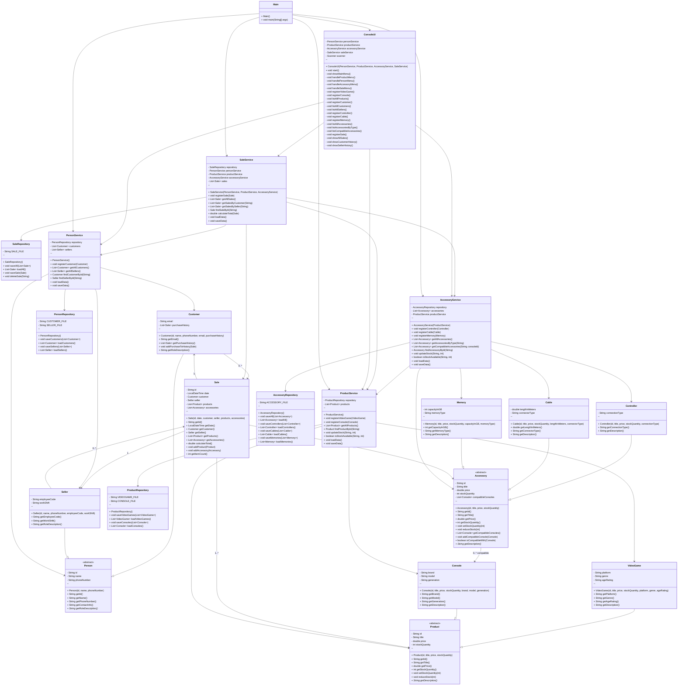

```mermaid
classDiagram
%% ============================================
%% MODEL LAYER - PERSON HIERARCHY
%% ============================================

    class Person {
        <<abstract>>
        - String id
        - String name
        - String phoneNumber
        --
        + Person(id, name, phoneNumber)
        + String getId()
        + String getName()
        + String getPhoneNumber()
        + String getContactInfo()
        + String getRoleDescription()*
    }

    class Customer {
        - String email
        - List~Sale~ purchaseHistory
        --
        + Customer(id, name, phoneNumber, email, purchaseHistory)
        + String getEmail()
        + List~Sale~ getPurchaseHistory()
        + void addPurchaseToHistory(Sale)
        + String getRoleDescription()
    }

    class Seller {
        - String employeeCode
        - String workShift
        --
        + Seller(id, name, phoneNumber, employeeCode, workShift)
        + String getEmployeeCode()
        + String getWorkShift()
        + String getRoleDescription()
    }

%% ============================================
%% MODEL LAYER - PRODUCT HIERARCHY
%% ============================================

    class Product {
        <<abstract>>
        - String id
        - String title
        - double price
        - int stockQuantity
        --
        + Product(id, title, price, stockQuantity)
        + String getId()
        + String getTitle()
        + double getPrice()
        + int getStockQuantity()
        + void setStockQuantity(int)
        + void reduceStock(int)
        + String getDescription()*
    }

    class VideoGame {
        - String platform
        - String genre
        - String ageRating
        --
        + VideoGame(id, title, price, stockQuantity, platform, genre, ageRating)
        + String getPlatform()
        + String getGenre()
        + String getAgeRating()
        + String getDescription()
    }

    class Console {
        - String brand
        - String model
        - String generation
        --
        + Console(id, title, price, stockQuantity, brand, model, generation)
        + String getBrand()
        + String getModel()
        + String getGeneration()
        + String getDescription()
    }

%% ============================================
%% MODEL LAYER - ACCESSORY HIERARCHY (REQ 1)
%% ============================================

    class Accessory {
        <<abstract>>
        - String id
        - String title
        - double price
        - int stockQuantity
        - List~Console~ compatibleConsoles
        --
        + Accessory(id, title, price, stockQuantity)
        + String getId()
        + String getTitle()
        + double getPrice()
        + int getStockQuantity()
        + void setStockQuantity(int)
        + void reduceStock(int)
        + List~Console~ getCompatibleConsoles()
        + void addCompatibleConsole(Console)
        + boolean isCompatibleWith(Console)
        + String getDescription()*
    }

    class Controller {
        - String connectionType
        --
        + Controller(id, title, price, stockQuantity, connectionType)
        + String getConnectionType()
        + String getDescription()
    }

    class Cable {
        - double lengthInMeters
        - String connectorType
        --
        + Cable(id, title, price, stockQuantity, lengthInMeters, connectorType)
        + double getLengthInMeters()
        + String getConnectorType()
        + String getDescription()
    }

    class Memory {
        - int capacityInGB
        - String memoryType
        --
        + Memory(id, title, price, stockQuantity, capacityInGB, memoryType)
        + int getCapacityInGB()
        + String getMemoryType()
        + String getDescription()
    }

%% ============================================
%% MODEL LAYER - SALE CLASS
%% ============================================

    class Sale {
        - String id
        - LocalDateTime date
        - Customer customer
        - Seller seller
        - List~Product~ products
        - List~Accessory~ accessories
        --
        + Sale(id, date, customer, seller, products, accessories)
        + String getId()
        + LocalDateTime getDate()
        + Customer getCustomer()
        + Seller getSeller()
        + List~Product~ getProducts()
        + List~Accessory~ getAccessories()
        + double calculateTotal()
        + void addProduct(Product)
        + void addAccessory(Accessory)
        + int getItemCount()
    }

%% ============================================
%% PERSISTENCE LAYER
%% ============================================

    class PersonRepository {
        - String CUSTOMER_FILE
        - String SELLER_FILE
        --
        + PersonRepository()
        + void saveCustomers(List~Customer~)
        + List~Customer~ loadCustomers()
        + void saveSellers(List~Seller~)
        + List~Seller~ loadSellers()
    }

    class ProductRepository {
        - String VIDEOGAME_FILE
        - String CONSOLE_FILE
        --
        + ProductRepository()
        + void saveVideoGames(List~VideoGame~)
        + List~VideoGame~ loadVideoGames()
        + void saveConsoles(List~Console~)
        + List~Console~ loadConsoles()
    }

    class AccessoryRepository {
        - String ACCESSORY_FILE
        --
        + AccessoryRepository()
        + void saveAll(List~Accessory~)
        + List~Accessory~ loadAll()
        + void saveControllers(List~Controller~)
        + List~Controller~ loadControllers()
        + void saveCables(List~Cable~)
        + List~Cable~ loadCables()
        + void saveMemories(List~Memory~)
        + List~Memory~ loadMemories()
    }

    class SaleRepository {
        - String SALE_FILE
        --
        + SaleRepository()
        + void saveAll(List~Sale~)
        + List~Sale~ loadAll()
        + void saveSale(Sale)
        + void deleteSale(String)
    }

%% ============================================
%% SERVICE LAYER
%% ============================================

    class PersonService {
        - PersonRepository repository
        - List~Customer~ customers
        - List~Seller~ sellers
        --
        + PersonService()
        + void registerCustomer(Customer)
        + List~Customer~ getAllCustomers()
        + List~Seller~ getAllSellers()
        + Customer findCustomerById(String)
        + Seller findSellerById(String)
        + void loadData()
        + void saveData()
    }

    class ProductService {
        - ProductRepository repository
        - List~Product~ products
        --
        + ProductService()
        + void registerVideoGame(VideoGame)
        + void registerConsole(Console)
        + List~Product~ getAllProducts()
        + Product findProductById(String)
        + void updateStock(String, int)
        + boolean isStockAvailable(String, int)
        + void loadData()
        + void saveData()
    }

    class AccessoryService {
        - AccessoryRepository repository
        - List~Accessory~ accessories
        - ProductService productService
        --
        + AccessoryService(ProductService)
        + void registerController(Controller)
        + void registerCable(Cable)
        + void registerMemory(Memory)
        + List~Accessory~ getAllAccessories()
        + List~Accessory~ getAccessoriesByType(String)
        + List~Accessory~ getCompatibleAccessories(String consoleId)
        + Accessory findAccessoryById(String)
        + void updateStock(String, int)
        + boolean isStockAvailable(String, int)
        + void loadData()
        + void saveData()
    }

    class SaleService {
        - SaleRepository repository
        - PersonService personService
        - ProductService productService
        - AccessoryService accessoryService
        - List~Sale~ sales
        --
        + SaleService(PersonService, ProductService, AccessoryService)
        + void registerSale(Sale)
        + List~Sale~ getAllSales()
        + List~Sale~ getSalesByCustomer(String)
        + List~Sale~ getSalesBySeller(String)
        + Sale findSaleById(String)
        + double calculateTotal(Sale)
        + void loadData()
        + void saveData()
    }

%% ============================================
%% UI LAYER
%% ============================================

    class ConsoleUI {
        - PersonService personService
        - ProductService productService
        - AccessoryService accessoryService
        - SaleService saleService
        - Scanner scanner
        --
        + ConsoleUI(PersonService, ProductService, AccessoryService, SaleService)
        + void start()
        - void showMainMenu()
        - void handleProductMenu()
        - void handlePersonMenu()
        - void handleAccessoryMenu()
        - void handleSaleMenu()
        - void registerVideoGame()
        - void registerConsole()
        - void listAllProducts()
        - void registerCustomer()
        - void listAllCustomers()
        - void listAllSellers()
        - void registerController()
        - void registerCable()
        - void registerMemory()
        - void listAllAccessories()
        - void listAccessoriesByType()
        - void listCompatibleAccessories()
        - void registerSale()
        - void showAllSales()
        - void showCustomerHistory()
        - void showSellerHistory()
    }

%% ============================================
%% MAIN CLASS
%% ============================================

    class Main {
        + Main()
        + void main(String[] args)
    }

%% ============================================
%% INHERITANCE RELATIONSHIPS
%% ============================================

    Customer --|> Person
    Seller --|> Person
    VideoGame --|> Product
    Console --|> Product
    Controller --|> Accessory
    Cable --|> Accessory
    Memory --|> Accessory

%% ============================================
%% ASSOCIATION RELATIONSHIPS
%% ============================================

    Sale --> Customer : 1
    Sale --> Seller : 1
    Sale --> Product : 1..*
    Sale --> Accessory : 0..*

    Customer --> Sale : 0..*
    Seller --> Sale : 0..*

    Accessory --> Console : 0..* compatible

%% ============================================
%% DEPENDENCY RELATIONSHIPS - SERVICE LAYER
%% ============================================

    PersonService --> PersonRepository
    PersonService --> Person
    PersonService --> Customer
    PersonService --> Seller

    ProductService --> ProductRepository
    ProductService --> Product
    ProductService --> VideoGame
    ProductService --> Console

    AccessoryService --> AccessoryRepository
    AccessoryService --> Accessory
    AccessoryService --> Controller
    AccessoryService --> Cable
    AccessoryService --> Memory
    AccessoryService --> ProductService

    SaleService --> SaleRepository
    SaleService --> PersonService
    SaleService --> ProductService
    SaleService --> AccessoryService
    SaleService --> Sale

%% ============================================
%% DEPENDENCY RELATIONSHIPS - UI LAYER
%% ============================================

    ConsoleUI --> PersonService
    ConsoleUI --> ProductService
    ConsoleUI --> AccessoryService
    ConsoleUI --> SaleService

    Main --> ConsoleUI
    Main --> PersonService
    Main --> ProductService
    Main --> AccessoryService
    Main --> SaleService
```