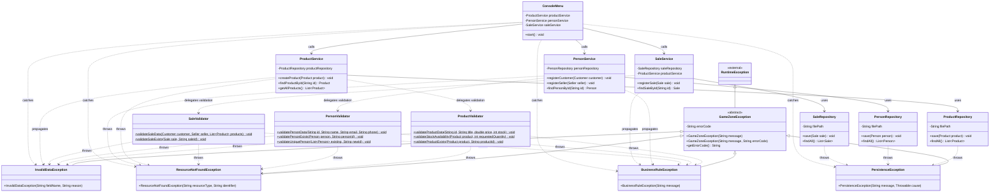

```mermaid
classDiagram
    direction TB

    %% ===========================================================
    %% JAVA BASE
    %% ===========================================================
    class RuntimeException {
        <<external>>
    }

    %% ===========================================================
    %% EXCEPTIONS LAYER (com.gamezone.exceptions)
    %% ===========================================================
    class GameZoneException {
        <<abstract>>
        -String errorCode
        +GameZoneException(String message)
        +GameZoneException(String message, String errorCode)
        +getErrorCode() String
    }

    class ResourceNotFoundException {
        +ResourceNotFoundException(String resourceType, String identifier)
    }

    class BusinessRuleException {
        +BusinessRuleException(String message)
    }

    class InvalidDataException {
        +InvalidDataException(String fieldName, String reason)
    }

    class PersistenceException {
        +PersistenceException(String message, Throwable cause)
    }

    %% ===========================================================
    %% VALIDATION LAYER (com.gamezone.validation)
    %% ===========================================================
    class ProductValidator {
        +validateProductData(String id, String title, double price, int stock) void$
        +validateStockAvailability(Product product, int requestedQuantity) void$
        +validateProductExists(Product product, String productId) void$
    }

    class PersonValidator {
        +validatePersonData(String id, String name, String email, String phone) void$
        +validatePersonExists(Person person, String personId) void$
        +validateUniquePerson(List~Person~ existing, String newId) void$
    }

    class SaleValidator {
        +validateSaleData(Customer customer, Seller seller, List~Product~ products) void$
        +validateSaleExists(Sale sale, String saleId) void$
    }

    %% ===========================================================
    %% SERVICE LAYER (com.gamezone.service)
    %% ===========================================================
    class ProductService {
        -ProductRepository productRepository
        +createProduct(Product product) void
        +findProductById(String id) Product
        +getAllProducts() List~Product~
    }

    class PersonService {
        -PersonRepository personRepository
        +registerCustomer(Customer customer) void
        +registerSeller(Seller seller) void
        +findPersonById(String id) Person
    }

    class SaleService {
        -SaleRepository saleRepository
        -ProductService productService
        +registerSale(Sale sale) void
        +findSaleById(String id) Sale
    }

    %% ===========================================================
    %% PERSISTENCE LAYER (com.gamezone.persistence)
    %% ===========================================================
    class ProductRepository {
        -String filePath
        +save(Product product) void
        +findAll() List~Product~
    }

    class PersonRepository {
        -String filePath
        +save(Person person) void
        +findAll() List~Person~
    }

    class SaleRepository {
        -String filePath
        +save(Sale sale) void
        +findAll() List~Sale~
    }

    %% ===========================================================
    %% UI LAYER (com.gamezone.ui)
    %% ===========================================================
    class ConsoleMenu {
        -ProductService productService
        -PersonService personService
        -SaleService saleService
        +start() void
    }

    %% ===========================================================
    %% RELATIONSHIPS
    %% ===========================================================
    
    %% Herencia de Excepciones
    RuntimeException <|-- GameZoneException
    GameZoneException <|-- ResourceNotFoundException
    GameZoneException <|-- BusinessRuleException
    GameZoneException <|-- InvalidDataException
    GameZoneException <|-- PersistenceException

    %% Validadores lanzan excepciones especializadas
    ProductValidator ..> InvalidDataException : throws
    ProductValidator ..> BusinessRuleException : throws
    ProductValidator ..> ResourceNotFoundException : throws

    PersonValidator ..> InvalidDataException : throws
    PersonValidator ..> BusinessRuleException : throws
    PersonValidator ..> ResourceNotFoundException : throws

    SaleValidator ..> InvalidDataException : throws
    SaleValidator ..> BusinessRuleException : throws
    SaleValidator ..> ResourceNotFoundException : throws

    %% Repositorios capturan IOException y relanzan PersistenceException
    ProductRepository ..> PersistenceException : throws
    PersonRepository ..> PersistenceException : throws
    SaleRepository ..> PersistenceException : throws

    %% Servicios delegan validaciones
    ProductService ..> ProductValidator : delegates validation
    PersonService ..> PersonValidator : delegates validation
    SaleService ..> SaleValidator : delegates validation

    %% Servicios usan repositorios
    ProductService --> ProductRepository : uses
    PersonService --> PersonRepository : uses
    SaleService --> SaleRepository : uses

    %% Servicios lanzan/propagan excepciones
    ProductService ..> ResourceNotFoundException : throws
    ProductService ..> InvalidDataException : propagates
    PersonService ..> BusinessRuleException : propagates
    PersonService ..> ResourceNotFoundException : throws
    SaleService ..> BusinessRuleException : propagates

    %% UI consume Servicios y captura excepciones diferenciadas
    ConsoleMenu --> ProductService : calls
    ConsoleMenu --> PersonService : calls
    ConsoleMenu --> SaleService : calls
    ConsoleMenu ..> ResourceNotFoundException : catches
    ConsoleMenu ..> BusinessRuleException : catches
    ConsoleMenu ..> InvalidDataException : catches
    ConsoleMenu ..> PersistenceException : catches
```
