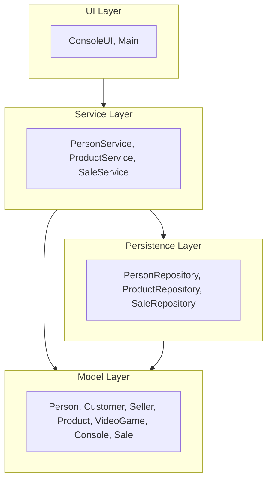

# Layers Diagram

```mermaid
graph TD
    subgraph UI["UI Layer"]
        UI_Classes["ConsoleUI, Main"]
    end
    
    subgraph Service["Service Layer"]
        Service_Classes["PersonService, ProductService, SaleService"]
    end
    
    subgraph Persistence["Persistence Layer"]
        Persistence_Classes["PersonRepository, ProductRepository, SaleRepository"]
    end
    
    subgraph Model["Model Layer"]
        Model_Classes["Person, Customer, Seller, Product, VideoGame, Console, Sale"]
    end
    
    UI --> Service
    Service --> Persistence
    Service --> Model
    Persistence --> Model
```