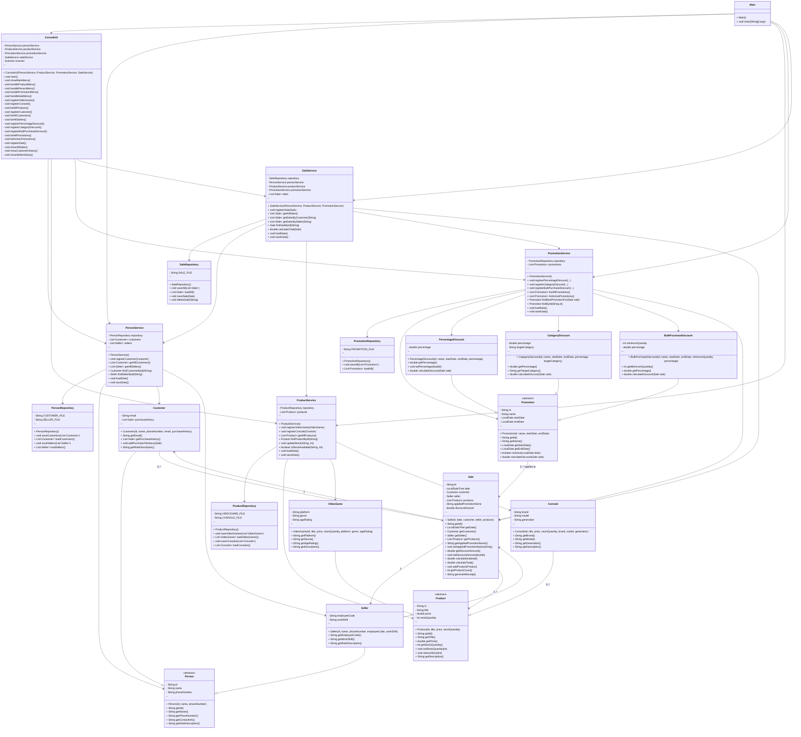

```mermaid
classDiagram
%% ============================================
%% MODEL LAYER - PERSON HIERARCHY
%% ============================================

    class Person {
        <<abstract>>
        - String id
        - String name
        - String phoneNumber
        --
        + Person(id, name, phoneNumber)
        + String getId()
        + String getName()
        + String getPhoneNumber()
        + String getContactInfo()
        + String getRoleDescription()*
    }
    
    class Customer {
        - String email
        - List~Sale~ purchaseHistory
        --
        + Customer(id, name, phoneNumber, email, purchaseHistory)
        + String getEmail()
        + List~Sale~ getPurchaseHistory()
        + void addPurchaseToHistory(Sale)
        + String getRoleDescription()
    }
    
    class Seller {
        - String employeeCode
        - String workShift
        --
        + Seller(id, name, phoneNumber, employeeCode, workShift)
        + String getEmployeeCode()
        + String getWorkShift()
        + String getRoleDescription()
    }
    
    %% ============================================
    %% MODEL LAYER - PRODUCT HIERARCHY
    %% ============================================
    
    class Product {
        <<abstract>>
        - String id
        - String title
        - double price
        - int stockQuantity
        --
        + Product(id, title, price, stockQuantity)
        + String getId()
        + String getTitle()
        + double getPrice()
        + int getStockQuantity()
        + void setStockQuantity(int)
        + void reduceStock(int)
        + String getDescription()*
    }
    
    class VideoGame {
        - String platform
        - String genre
        - String ageRating
        --
        + VideoGame(id, title, price, stockQuantity, platform, genre, ageRating)
        + String getPlatform()
        + String getGenre()
        + String getAgeRating()
        + String getDescription()
    }
    
    class Console {
        - String brand
        - String model
        - String generation
        --
        + Console(id, title, price, stockQuantity, brand, model, generation)
        + String getBrand()
        + String getModel()
        + String getGeneration()
        + String getDescription()
    }
    
    %% ============================================
    %% MODEL LAYER - PROMOTION HIERARCHY (REQ 2)
    %% ============================================
    
    class Promotion {
        <<abstract>>
        - String id
        - String name
        - LocalDate startDate
        - LocalDate endDate
        --
        + Promotion(id, name, startDate, endDate)
        + String getId()
        + String getName()
        + LocalDate getStartDate()
        + LocalDate getEndDate()
        + boolean isActive(LocalDate date)
        + double calculateDiscount(Sale sale)*
    }
    
    class PercentageDiscount {
        - double percentage
        --
        + PercentageDiscount(id, name, startDate, endDate, percentage)
        + double getPercentage()
        + void setPercentage(double)
        + double calculateDiscount(Sale sale)
    }
    
    class CategoryDiscount {
        - double percentage
        - String targetCategory
        --
        + CategoryDiscount(id, name, startDate, endDate, percentage, targetCategory)
        + double getPercentage()
        + String getTargetCategory()
        + double calculateDiscount(Sale sale)
    }
    
    class BulkPurchaseDiscount {
        - int minimumQuantity
        - double percentage
        --
        + BulkPurchaseDiscount(id, name, startDate, endDate, minimumQuantity, percentage)
        + int getMinimumQuantity()
        + double getPercentage()
        + double calculateDiscount(Sale sale)
    }
    
    %% ============================================
    %% MODEL LAYER - SALE CLASS
    %% ============================================
    
    class Sale {
        - String id
        - LocalDateTime date
        - Customer customer
        - Seller seller
        - List~Product~ products
        - String appliedPromotionName
        - double discountAmount
        --
        + Sale(id, date, customer, seller, products)
        + String getId()
        + LocalDateTime getDate()
        + Customer getCustomer()
        + Seller getSeller()
        + List~Product~ getProducts()
        + String getAppliedPromotionName()
        + void setAppliedPromotionName(String)
        + double getDiscountAmount()
        + void setDiscountAmount(double)
        + double calculateSubtotal()
        + double calculateTotal()
        + void addProduct(Product)
        + int getProductCount()
        + String generateReceipt()
    }
    
    %% ============================================
    %% PERSISTENCE LAYER
    %% ============================================
    
    class PersonRepository {
        - String CUSTOMER_FILE
        - String SELLER_FILE
        --
        + PersonRepository()
        + void saveCustomers(List~Customer~)
        + List~Customer~ loadCustomers()
        + void saveSellers(List~Seller~)
        + List~Seller~ loadSellers()
    }
    
    class ProductRepository {
        - String VIDEOGAME_FILE
        - String CONSOLE_FILE
        --
        + ProductRepository()
        + void saveVideoGames(List~VideoGame~)
        + List~VideoGame~ loadVideoGames()
        + void saveConsoles(List~Console~)
        + List~Console~ loadConsoles()
    }
    
    class PromotionRepository {
        - String PROMOTION_FILE
        --
        + PromotionRepository()
        + void saveAll(List~Promotion~)
        + List~Promotion~ loadAll()
    }
    
    class SaleRepository {
        - String SALE_FILE
        --
        + SaleRepository()
        + void saveAll(List~Sale~)
        + List~Sale~ loadAll()
        + void saveSale(Sale)
        + void deleteSale(String)
    }
    
    %% ============================================
    %% SERVICE LAYER
    %% ============================================
    
    class PersonService {
        - PersonRepository repository
        - List~Customer~ customers
        - List~Seller~ sellers
        --
        + PersonService()
        + void registerCustomer(Customer)
        + List~Customer~ getAllCustomers()
        + List~Seller~ getAllSellers()
        + Customer findCustomerById(String)
        + Seller findSellerById(String)
        + void loadData()
        + void saveData()
    }
    
    class ProductService {
        - ProductRepository repository
        - List~Product~ products
        --
        + ProductService()
        + void registerVideoGame(VideoGame)
        + void registerConsole(Console)
        + List~Product~ getAllProducts()
        + Product findProductById(String)
        + void updateStock(String, int)
        + boolean isStockAvailable(String, int)
        + void loadData()
        + void saveData()
    }
    
    class PromotionService {
        - PromotionRepository repository
        - List~Promotion~ promotions
        --
        + PromotionService()
        + void registerPercentageDiscount(...)
        + void registerCategoryDiscount(...)
        + void registerBulkPurchaseDiscount(...)
        + List~Promotion~ listAllPromotions()
        + List~Promotion~ listActivePromotions()
        + Promotion findBestPromotionFor(Sale sale)
        + Promotion findById(String id)
        + void loadData()
        + void saveData()
    }
    
    class SaleService {
        - SaleRepository repository
        - PersonService personService
        - ProductService productService
        - PromotionService promotionService
        - List~Sale~ sales
        --
        + SaleService(PersonService, ProductService, PromotionService)
        + void registerSale(Sale)
        + List~Sale~ getAllSales()
        + List~Sale~ getSalesByCustomer(String)
        + List~Sale~ getSalesBySeller(String)
        + Sale findSaleById(String)
        + double calculateTotal(Sale)
        + void loadData()
        + void saveData()
    }
    
    %% ============================================
    %% UI LAYER
    %% ============================================
    
    class ConsoleUI {
        - PersonService personService
        - ProductService productService
        - PromotionService promotionService
        - SaleService saleService
        - Scanner scanner
        --
        + ConsoleUI(PersonService, ProductService, PromotionService, SaleService)
        + void start()
        - void showMainMenu()
        - void handleProductMenu()
        - void handlePersonMenu()
        - void handlePromotionMenu()
        - void handleSaleMenu()
        - void registerVideoGame()
        - void registerConsole()
        - void listAllProducts()
        - void registerCustomer()
        - void listAllCustomers()
        - void listAllSellers()
        - void registerPercentageDiscount()
        - void registerCategoryDiscount()
        - void registerBulkPurchaseDiscount()
        - void listAllPromotions()
        - void listActivePromotions()
        - void registerSale()
        - void showAllSales()
        - void showCustomerHistory()
        - void showSellerHistory()
    }
    
    %% ============================================
    %% MAIN CLASS
    %% ============================================
    
    class Main {
        + Main()
        + void main(String[] args)
    }
    
    %% ============================================
    %% INHERITANCE RELATIONSHIPS
    %% ============================================
    
    Customer --|> Person
    Seller --|> Person
    VideoGame --|> Product
    Console --|> Product
    PercentageDiscount --|> Promotion
    CategoryDiscount --|> Promotion
    BulkPurchaseDiscount --|> Promotion
    
    %% ============================================
    %% ASSOCIATION RELATIONSHIPS
    %% ============================================
    
    Sale --> Customer : 1
    Sale --> Seller : 1
    Sale --> Product : 1..*
    
    Customer --> Sale : 0..*
    Seller --> Sale : 0..*
    
    Promotion --> Sale : 0..* applies to
    
    %% ============================================
    %% DEPENDENCY RELATIONSHIPS - SERVICE LAYER
    %% ============================================
    
    PersonService --> PersonRepository
    PersonService --> Person
    PersonService --> Customer
    PersonService --> Seller
    
    ProductService --> ProductRepository
    ProductService --> Product
    ProductService --> VideoGame
    ProductService --> Console
    
    PromotionService --> PromotionRepository
    PromotionService --> Promotion
    PromotionService --> PercentageDiscount
    PromotionService --> CategoryDiscount
    PromotionService --> BulkPurchaseDiscount
    PromotionService --> Sale
    
    SaleService --> SaleRepository
    SaleService --> PersonService
    SaleService --> ProductService
    SaleService --> PromotionService
    SaleService --> Sale
    
    %% ============================================
    %% DEPENDENCY RELATIONSHIPS - UI LAYER
    %% ============================================
    
    ConsoleUI --> PersonService
    ConsoleUI --> ProductService
    ConsoleUI --> PromotionService
    ConsoleUI --> SaleService
    
    Main --> ConsoleUI
    Main --> PersonService
    Main --> ProductService
    Main --> PromotionService
    Main --> SaleService
```