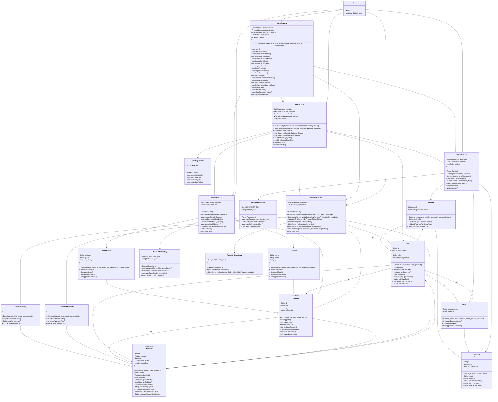

```mermaid
classDiagram
    %% ============================================
    %% MODEL LAYER - PERSON HIERARCHY
    %% ============================================
    
    class Person {
        <<abstract>>
        - String id
        - String name
        - String phoneNumber
        --
        + Person(id, name, phoneNumber)
        + String getId()
        + String getName()
        + String getPhoneNumber()
        + String getContactInfo()
        + String getRoleDescription()*
    }
    
    class Customer {
        - String email
        - List~Sale~ purchaseHistory
        --
        + Customer(id, name, phoneNumber, email, purchaseHistory)
        + String getEmail()
        + List~Sale~ getPurchaseHistory()
        + void addPurchaseToHistory(Sale)
        + String getRoleDescription()
    }
    
    class Seller {
        - String employeeCode
        - String workShift
        --
        + Seller(id, name, phoneNumber, employeeCode, workShift)
        + String getEmployeeCode()
        + String getWorkShift()
        + String getRoleDescription()
    }
    
    %% ============================================
    %% MODEL LAYER - PRODUCT HIERARCHY
    %% ============================================
    
    class Product {
        <<abstract>>
        - String id
        - String title
        - double price
        - int stockQuantity
        --
        + Product(id, title, price, stockQuantity)
        + String getId()
        + String getTitle()
        + double getPrice()
        + int getStockQuantity()
        + void setStockQuantity(int)
        + void reduceStock(int)
        + String getDescription()*
    }
    
    class VideoGame {
        - String platform
        - String genre
        - String ageRating
        --
        + VideoGame(id, title, price, stockQuantity, platform, genre, ageRating)
        + String getPlatform()
        + String getGenre()
        + String getAgeRating()
        + String getDescription()
    }
    
    class Console {
        - String brand
        - String model
        - String generation
        --
        + Console(id, title, price, stockQuantity, brand, model, generation)
        + String getBrand()
        + String getModel()
        + String getGeneration()
        + String getDescription()
    }
    
    %% ============================================
    %% MODEL LAYER - WARRANTY HIERARCHY (REQ 4)
    %% ============================================
    
    class Warranty {
        <<abstract>>
        - String id
        - Product product
        - Sale sale
        - LocalDate startDate
        - LocalDate endDate
        --
        + Warranty(id, product, sale, startDate)
        + String getId()
        + Product getProduct()
        + Sale getSale()
        + LocalDate getStartDate()
        + LocalDate getEndDate()
        + int getDurationInMonths()*
        + String getWarrantyType()*
        + double getAdditionalCost()*
        + boolean isActive(LocalDate date)
        + String generateWarrantyCertificate()
    }
    
    class BasicWarranty {
        --
        + BasicWarranty(id, product, sale, startDate)
        + int getDurationInMonths()
        + String getWarrantyType()
        + double getAdditionalCost()
    }
    
    class ExtendedWarranty {
        --
        + ExtendedWarranty(id, product, sale, startDate)
        + int getDurationInMonths()
        + String getWarrantyType()
        + double getAdditionalCost()
    }
    
    %% ============================================
    %% MODEL LAYER - SALE CLASS
    %% ============================================
    
    class Sale {
        - String id
        - LocalDateTime date
        - Customer customer
        - Seller seller
        - List~Product~ products
        --
        + Sale(id, date, customer, seller, products)
        + String getId()
        + LocalDateTime getDate()
        + Customer getCustomer()
        + Seller getSeller()
        + List~Product~ getProducts()
        + double calculateTotal()
        + void addProduct(Product)
        + int getProductCount()
    }
    
    %% ============================================
    %% PERSISTENCE LAYER
    %% ============================================
    
    class PersonRepository {
        - String CUSTOMER_FILE
        - String SELLER_FILE
        --
        + PersonRepository()
        + void saveCustomers(List~Customer~)
        + List~Customer~ loadCustomers()
        + void saveSellers(List~Seller~)
        + List~Seller~ loadSellers()
    }
    
    class ProductRepository {
        - String VIDEOGAME_FILE
        - String CONSOLE_FILE
        --
        + ProductRepository()
        + void saveVideoGames(List~VideoGame~)
        + List~VideoGame~ loadVideoGames()
        + void saveConsoles(List~Console~)
        + List~Console~ loadConsoles()
    }
    
    class WarrantyRepository {
        - String WARRANTY_FILE
        --
        + WarrantyRepository()
        + void saveAll(List~Warranty~)
        + List~Warranty~ loadAll(List~Sale~ sales, List~Product~ products)
    }
    
    class SaleRepository {
        - String SALE_FILE
        --
        + SaleRepository()
        + void saveAll(List~Sale~)
        + List~Sale~ loadAll()
        + void saveSale(Sale)
        + void deleteSale(String)
    }
    
    %% ============================================
    %% SERVICE LAYER
    %% ============================================
    
    class PersonService {
        - PersonRepository repository
        - List~Customer~ customers
        - List~Seller~ sellers
        --
        + PersonService()
        + void registerCustomer(Customer)
        + List~Customer~ getAllCustomers()
        + List~Seller~ getAllSellers()
        + Customer findCustomerById(String)
        + Seller findSellerById(String)
        + void loadData()
        + void saveData()
    }
    
    class ProductService {
        - ProductRepository repository
        - List~Product~ products
        --
        + ProductService()
        + void registerVideoGame(VideoGame)
        + void registerConsole(Console)
        + List~Product~ getAllProducts()
        + Product findProductById(String)
        + void updateStock(String, int)
        + boolean isStockAvailable(String, int)
        + void loadData()
        + void saveData()
    }
    
    class WarrantyService {
        - WarrantyRepository repository
        - List~Warranty~ warranties
        --
        + WarrantyService()
        + BasicWarranty assignBasicWarranty(Product, Sale, LocalDate)
        + ExtendedWarranty assignExtendedWarranty(Product, Sale, LocalDate)
        + Warranty findWarrantyByProduct(String, String)
        + List~Warranty~ listAllWarranties()
        + List~Warranty~ listActiveWarranties()
        + List~Warranty~ listWarrantiesExpiringSoon(int)
        + void loadData(List~Sale~ sales, List~Product~ products)
        + void saveData()
    }
    
    class SaleService {
        - SaleRepository repository
        - PersonService personService
        - ProductService productService
        - WarrantyService warrantyService
        - List~Sale~ sales
        --
        + SaleService(PersonService, ProductService, WarrantyService)
        + void registerSale(Sale, List~String~ extendedWarrantyProductIds)
        + List~Sale~ getAllSales()
        + List~Sale~ getSalesByCustomer(String)
        + List~Sale~ getSalesBySeller(String)
        + Sale findSaleById(String)
        + double calculateTotal(Sale)
        + void loadData()
        + void saveData()
    }
    
    %% ============================================
    %% UI LAYER
    %% ============================================
    
    class ConsoleMenu {
        - PersonService personService
        - ProductService productService
        - WarrantyService warrantyService
        - SaleService saleService
        - Scanner scanner
        --
        + ConsoleMenu(PersonService, ProductService, WarrantyService, SaleService)
        + void start()
        - void showMainMenu()
        - void handleProductMenu()
        - void handlePersonMenu()
        - void handleWarrantyMenu()
        - void handleSaleMenu()
        - void registerVideoGame()
        - void registerConsole()
        - void listAllProducts()
        - void registerCustomer()
        - void listAllCustomers()
        - void listAllSellers()
        - void consultWarrantyByProduct()
        - void listAllWarranties()
        - void listActiveWarranties()
        - void listWarrantiesExpiringSoon()
        - void registerSale()
        - void showAllSales()
        - void showCustomerHistory()
        - void showSellerHistory()
    }
    
    %% ============================================
    %% MAIN CLASS
    %% ============================================
    
    class Main {
        + Main()
        + void main(String[] args)
    }
    
    %% ============================================
    %% INHERITANCE RELATIONSHIPS
    %% ============================================
    
    Customer --|> Person
    Seller --|> Person
    VideoGame --|> Product
    Console --|> Product
    BasicWarranty --|> Warranty
    ExtendedWarranty --|> Warranty
    
    %% ============================================
    %% ASSOCIATION RELATIONSHIPS
    %% ============================================
    
    Sale --> Customer : 1
    Sale --> Seller : 1
    Sale --> Product : 1..*
    
    Customer --> Sale : 0..*
    Seller --> Sale : 0..*
    
    Warranty --> Product : 1
    Warranty --> Sale : 1
    Product --> Warranty : 0..*
    Sale --> Warranty : 0..*
    
    %% ============================================
    %% DEPENDENCY RELATIONSHIPS - SERVICE LAYER
    %% ============================================
    
    PersonService --> PersonRepository
    PersonService --> Person
    PersonService --> Customer
    PersonService --> Seller
    
    ProductService --> ProductRepository
    ProductService --> Product
    ProductService --> VideoGame
    ProductService --> Console
    
    WarrantyService --> WarrantyRepository
    WarrantyService --> Warranty
    WarrantyService --> BasicWarranty
    WarrantyService --> ExtendedWarranty
    WarrantyService --> Product
    WarrantyService --> Sale
    
    SaleService --> SaleRepository
    SaleService --> PersonService
    SaleService --> ProductService
    SaleService --> WarrantyService
    SaleService --> Sale
    
    %% ============================================
    %% DEPENDENCY RELATIONSHIPS - UI LAYER
    %% ============================================
    
    ConsoleMenu --> PersonService
    ConsoleMenu --> ProductService
    ConsoleMenu --> WarrantyService
    ConsoleMenu --> SaleService
    
    Main --> ConsoleMenu
    Main --> PersonService
    Main --> ProductService
    Main --> WarrantyService
    Main --> SaleService
```
